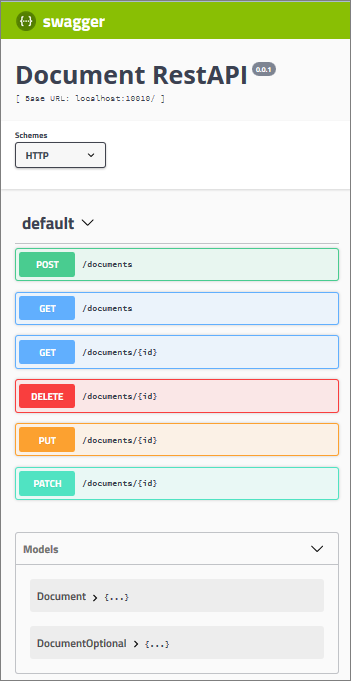

# Example RestAPI with Swagger 2.0, Express, Sequelize and SQLite3

This beginners example project demonstrates the use of Swagger-Node together with Express, Sequelize, Swagger-Sequelize and SQLite3 to build a little RestAPI for a "document server". The "documents" are simple objects with text attributes `title`, `author` and `content`. The project also includes a little tutorial.


## Table of contents

* [Prerequisites](#prerequisites)
* [Download and Installation](#download-and-installation)
* [Storage Space Requirements](#storage-space-requirements)
* [Run and explore the Server](#run-and-explore-the-server)
  * [First Steps in the Browser](#first-steps-in-the-browser)
  * [More Power with Swagger UI](#more-power-with-swagger-ui)
* [More Documentation and Tutorial](#more-documentation-and-tutorial)
* [Additional Information, Weblinks](#additional-information-weblinks)

## Prerequisites

* If not done already: Install [NodeJS](https://nodejs.org) **v6** or higher on your computer.
* If not done already: Install Swagger-Node by `npm install -g swagger` (only needed if you want to modify the server or follow the tutorial)

## Download and Installation

* Clone this project with Git or download ZIP and unpack into your favorite working folder.
* Open a terminal and change directory to the project folger, i.e. `swagger2-express-sequelize`.
* Run `npm install` and wait until it's done.


## Storage Space Requirements

Just for reference, the storage space requirements of the main modules (especially driven by the `node_modules` folder) are summarized in the following table:

| Node Modules | Size |
|:-------------|:-----|
| Bare project with Swagger and Express (and dependencies)                           | 23&nbsp;MByte |
| Adding "Swagger&nbsp;UI" via "swagger-ui-express" (and remaining dependencies)     | 15&nbsp;MByte |
| Adding "Sequelize", "SQLite3" and "Swagger-Sequelize" (and remaining dependencies) | 21&nbsp;MByte |
| **Total**                                                                      | **59&nbsp;MByte** |

The above numbers are taken from a Windows-10 system. The actual space requirements on the harddrive are slightly larger. This is because many files in the `node_modules` folder are smaller than the stanrard cluster size of 4&nbsp;kByte.


## Run and explore the Server

Fire up a terminal in the project folder `swagger2-express-sequelize` (or use the one from installation) and enter

```
npm start
```

(_Note:_ This command is translated into `node app.js` via `package.json`)

You should now have a new server online at http://localhost:10010 showing the **_Swagger&nbsp;UI_** for the RestAPI:



### First Steps in the Browser

Navigate your browser to http://localhost:10010/documents. You should get a JSON array with three documents:

```JSON
[
  {
    "id": 1,
    "title": "Where to go?",
    "author": "Harry Potter",
    "content": "How can I find my way to Hogwarts School of Witchcraft and Wizardry? Maybe by train?",
    "createdAt": "2018-01-22T10:57:59.197Z",
    "updatedAt": "2018-01-22T10:57:59.197Z"
  },
  {
    "id": 2,
    "title": "Important Todo",
    "author": "Hermione Granger",
    "content": "Study at the library.",
    "createdAt": "2018-01-22T10:59:22.608Z",
    "updatedAt": "2018-01-22T10:59:22.608Z"
  },
  {
    "id": 3,
    "title": "Task",
    "author": "Ron Weasley",
    "content": "Find Scabbers!",
    "createdAt": "2018-01-22T11:01:51.505Z",
    "updatedAt": "2018-01-22T11:01:51.505Z"
  }
]
```

This response comes from the predefined SQLite database file `db.sqlite`, which is located in the root of the project folder.

If you add a valid **id** at the end of the URL, you should get an individual document. For example, http://localhost:10010/documents/2 deliveres:

```JSON
{
  "id": 2,
  "title": "Important Todo",
  "author": "Hermione Granger",
  "content": "Study at the library.",
  "createdAt": "2018-01-22T10:59:22.608Z",
  "updatedAt": "2018-01-22T10:59:22.608Z"
}
```

An **invalid&nbsp;id** however, will result in an error message. For example, http://localhost:10010/documents/2002 deliveres:

```JSON
{
  "message": "The requested document with id 2002 could not be found. Please try another id."
}
```

### More Power with Swagger UI

Navigate your browser to http://localhost:10010. You should see the Swagger&nbsp;UI for the RestAPI:


**... to be continued ...**

&nbsp;

## More Documentation and Tutorial

More documentation and a beginner's tutorial can be found at

* [Overview: Architecture and Tools](./docs/arch_tools.md)
* [Beginner's Tutorial: RestAPI with Swagger, Express, Sequelize and SQLite](./docs/tutorial.md)


&nbsp;

## Additional Information, Weblinks

* HTTP and RestAPIs:
  * REST API Quick Tips: http://www.restapitutorial.com/lessons/restquicktips.html
  * Using HTTP Methods for RESTful Services: http://www.restapitutorial.com/lessons/httpmethods.html
  * Resource Naming: http://www.restapitutorial.com/lessons/restfulresourcenaming.html
  * HTTP Status Codes: http://www.restapitutorial.com/httpstatuscodes.html
* Swagger
  * HomePage: https://swagger.io/
  * Swagger 2.0 documentation: https://swagger.io/docs/specification/2-0/basic-structure/
* Sequelize
  * Documenation: http://docs.sequelizejs.com/
  * GitHub: https://github.com/sequelize/sequelize.git
