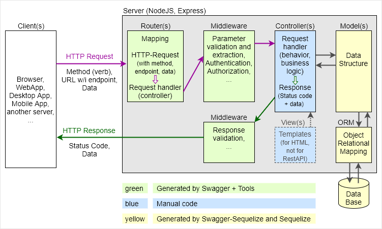

# Overview: Architecture and Tools

The following image shows the basic architecture of a server with a RestAPI implemented in NodeJS and Express:

With the help of some tools, many modules can be auto-generated:
* Swagger and Swagger Tool Chain:
  * Auto-generate Router and Middleware
  * Run Server with auto-reload during development
  * Run Server for Swagger Editor during development
* Swagger UI Express: Run Swagger UI during production (and development)
* Swagger-Sequelize: Auto-generate the Model
* Sequelize: Provide the object relational mapping (ORM)
* SQLite3: Implement a light-weight data base (at least for testing)
  * Other data bases (PostgreSQL, MySQL, MariaDB, ...) are possible, too.

Therefore, we can focus on the remaining tasks:
* Design and documentation of the RestAPI (via Swagger API specification)
  * Including a description of the data structure (for the Model(s))
* Implement the Server behaviour in the Controller(s).
  * Not for pure RestAPIs, only in case of some HTML-Responses: Design the View-Templates
* Test the API

With the help of Swagger, its related tools, Swagger-Sequelize and Sequelize, we can focus on the design and documentation of the RestAPI and the implementation inside the controllers.

All other modules can be auto-generated out the the Swagger API-Specification with the help of the Swagger tool chain, Swagger-Sequelize and Sequelize.
