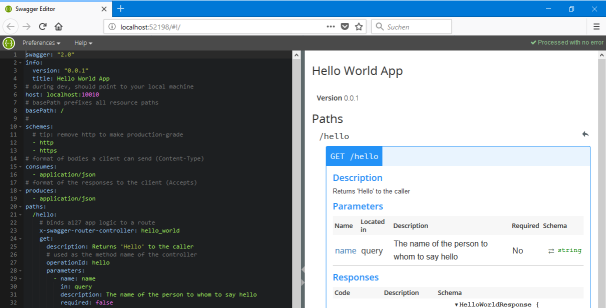
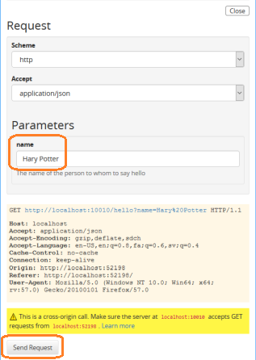
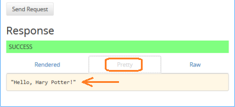
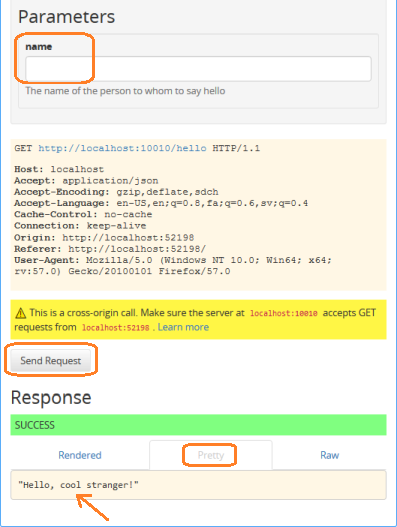

# Beginner's Tutorial - Part 1: A new Swagger Project

## Prerequisites

* If not done already: Install [NodeJS](https://nodejs.org) **v6** or higher.
* If not done already: Install Swagger-Node by `npm install -g swagger`

## Getting started

* Fire up a terminal, change to the folder of your desited working location, 
run `swagger project create swagger2-express-sequelize` and select "Express" as Framework.
* Wait until the project folder `swagger2-express-sequelize` is created and "npm&nbsp;install" is completed (needs internet connection).
* Change directory into the new project folder `swagger2-express-sequelize` and open your favourite texteditor (e.g. [VSCode](https://code.visualstudio.com/)) from there.
* To start the **_Express Server_** of our new RestAPI (with auto-reload), run `swagger project start` from within the project folder.
  * This fires up the express server on port 10010.
  * Navigate your web browser to http://localhost:10010/hello. 
    As response, you should get the JSON-String `"Hello, stranger!"`.
  * Navigate our web browser to http://localhost:10010/hello?name=Hary%20Potter. 
    As response, you should get the JSON-String `"Hello, Hary Potter!"`.
  * The server automatically detects file changes and restarts itself. If this creates too heavy CPU load, terminate it while editing and restart it for testing.
* To start the **_Swagger Editor_**, open an additional terminal (or dos-prompt) and run `swagger project edit` from within the project folder.
  * This fires up an additional server, the swagger editor server with a port number usually above 50000.
  * It also opens your standard web browser at the new URL.
  * You should see the Swagger YAML-Editor on the left and the UI-representation on the right: 
     
    Most likely, you will have a different port number than the one shown in the above screen shot.
  * You can test the express server from the UI-representation of the editor. In the right half, click on the button "Try&nbsp;this&nbsp;operation" and enter "Hary Potter" (without quotations) in the "name" field. Then, click on the button "send&nbsp;request" at the bottom: 
  
  * In the "Response" area, select the "Pretty" tab. You should see `"Hello, Hary Potter!"`. 
    
* Start to understand the project file structure:
  * Open the file `api/swagger/swagger.yaml` in your text editor. This is the file which is shown in the Swagger Editor in your browser. 
    * In the Swagger Editor in the browser, change line&nbsp;4 from `title: Hello World App` to `title: Hello Swagger World`. The file will automatically be saved while you are editing it.
    * You should see that the content of file `api/swagger/swagger.yaml` has been changed accordingly. Also, the Express Server will automatically be restarted.
  * Open the file `api/controllers/hello_world.js` in your text editor. 
    * At the bottom of the file, change line 
      `var name = req.swagger.params.name.value || 'stranger';` 
      to 
      `var name = req.swagger.params.name.value || 'cool stranger';`
    * Save the file. The Express Server will automatically be restarted.
    * In the UI part of the Swagger Editor, make sure that the field "name" is empty. Then, click on the button "send&nbsp;request". You should see `"Hello, cool stranger!"` as the response. 
    
* Terminate both, the _Express Server_ and the _Swagger Editor_ server with <kbd>ctrl</kbd>+<kbd>c</kbd> in each terminal.

## Summary

In this part, we created a new swagger project for the express framework. We fired up two servers:
* the **_Express Server_** for our "real" API with auto-reload capability.
* the **_Swagger Editor_** server for modifying the swagger spec file and for running http requests against the exress server.

We learned that the Swagger spec file is served from `api/swagger/swagger.yaml` and that the response behaviour of the server is defined in the controller file `api/controllers/hello_world.js`.

**Where to go from here**

Please continue with "[Part 2: Start your own API](./tut2-start-your-own-api.md)".

Alternatively, you can jump to the "[Beginner's Tutorial Overview Page](./tutorial.md)".

