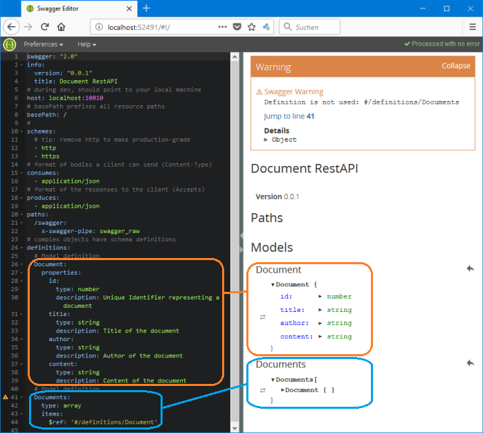
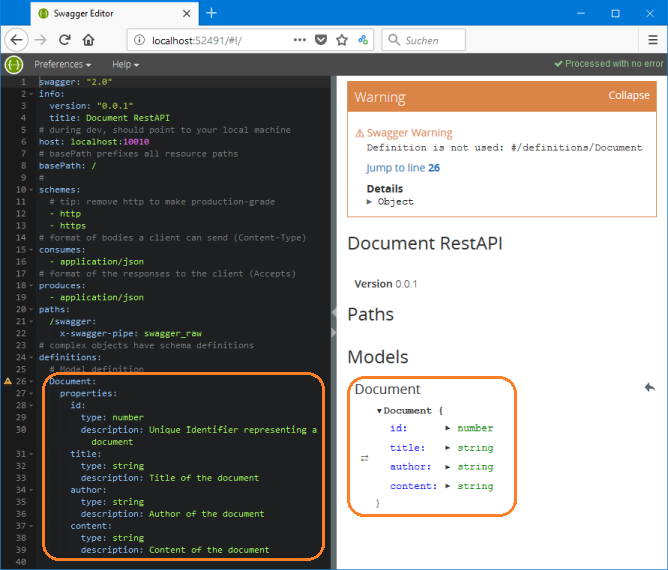

# Beginner's Tutorial - Step 2: Start your own API

## Spec Sceleton and Model Definition

Open the file `api/swagger/swagger.yaml` in your text editor and replace its entire contents with the following code:

```yaml
swagger: "2.0"
info:
  version: "0.0.1"
  title: Document RestAPI
# during dev, should point to your local machine
host: localhost:10010
# basePath prefixes all resource paths 
basePath: /
# 
schemes:
  # tip: remove http to make production-grade
  - http
# format of bodies a client can send (Content-Type)
consumes:
  - application/json
# format of the responses to the client (Accepts)
produces:
  - application/json
paths:
  /swagger:
    x-swagger-pipe: swagger_raw
# complex objects have schema definitions
definitions:
  # Model definition for a Document
  Document:
    properties:
      # The Sequelize-ORM will add id, createdAt and updatedAt
      title:
        type: string
        description: Title of the document
      author:
        type: string
        description: Author of the document
      content:
        type: string
        description: Content of the document
    required:
      - title
      - author
      - content
```

Start the Swagger Editor Server with `swagger project edit` This will automatically open the URL in your default browser (the Express server is not needed, yet):<br>

<!--  -->
<br>
_Note:_ The port number will vary from time to time.


## The first two Rest-Endpoints

Between 

```yaml
paths:
```

and

```yaml
  /swagger:
    x-swagger-pipe: swagger_raw
```

add the following paths:

```yaml
  /documents:
    x-swagger-router-controller: documents
    post:
      description: Add a new document
      operationId: create
      parameters:
        - name: newDocument
          description: Attributes of new document
          in: body
          required: true
          schema:
            $ref: "#/definitions/Document"
      responses:
        "201":
          description: Successfully created
          schema:
            $ref: "#/definitions/Document"
        default:
          $ref: "#/responses/ErrorResponse"
  /documents/{id}:
    x-swagger-router-controller: documents
    get:
      description: Get a document by its ID
      operationId: readById
      parameters:
        - name: id
          description: Document id
          type: number
          in: path
          required: true
      responses:
        "200":
          description: Success
          schema:
            $ref: "#/definitions/Document"
        default:
          $ref: "#/responses/ErrorResponse"
```

At the very end of the file, add the following response definition:


```yaml
# response definitions:
responses:
  ErrorResponse:
    description: Error
    schema:
      required:
        - message
      properties:
        message:
          type: string

```

## A Controller for your Documents

Create a new file `api/controllers/documents.js` with the following content:

```js
'use strict';

module.exports = {
  create,
  readById
};
  
function create(req, res) {
  const document = req.body;
  console.log("Controller: documents.js; Function: create() mit document:");
  console.log(document);
  // HIER: Datenbank-aufruf
  res.status(201).json(
    {
      success: 1,
      description: 'Document created and saved',
    }
  );
}

function readById(req, res) {
  const id = req.swagger.params.id.value;
  console.log("Controller: documents.js; Function: readById() mit id:", id);
  // Document mit id suchen.
  // Falls gefunden: res.json(document);
  // Falls nicht:    res.status(404).send();

  // Dummy-Wert:
  const resultObject = {
    id: id,
    title: "Titel des Dokuments",
    author: "Meiner einer",
    content: "Inhalt des Dokuments"
  }
  console.log("Controller: documents.js; Function: readById(): Liefere Objekt");
  console.log(resultObject);
  res.json(resultObject);
}
```

... to be continued ...
