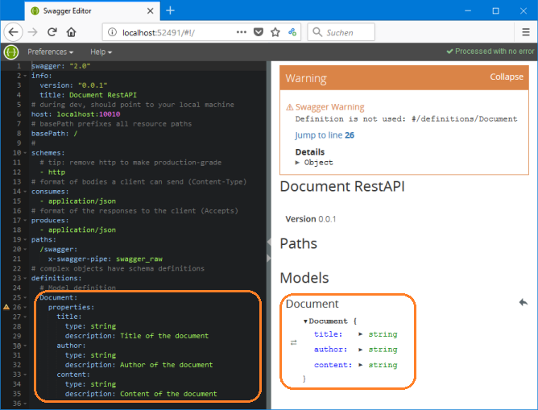
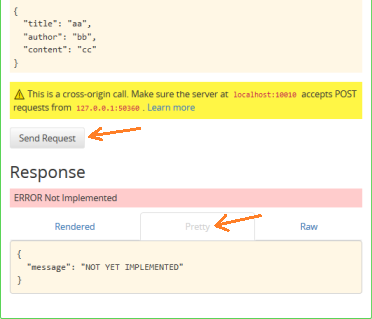

# Beginner's Tutorial - Part 2: Start your own API

## Spec Sceleton and Model Definition

Open the file `api/swagger/swagger.yaml` in your favourite text editor or in the _Swagger Editor_ (as learned in the previous part) and replace its entire contents with the following code:

```yaml
swagger: "2.0"
info:
  version: "0.0.1"
  title: Document RestAPI
# during dev, should point to your local machine
host: localhost:10010
# basePath prefixes all resource paths 
basePath: /
# 
schemes:
  # tip: remove http to make production-grade
  - http
# format of bodies a client can send (Content-Type)
consumes:
  - application/json
# format of the responses to the client (Accepts)
produces:
  - application/json
paths:
  /swagger:
    x-swagger-pipe: swagger_raw
# complex objects have schema definitions
definitions:
  # Model definition for a Document
  Document:
    properties:
      # The Sequelize-ORM will add id, createdAt and updatedAt
      title:
        type: string
        description: Title of the document
      author:
        type: string
        description: Author of the document
      content:
        type: string
        description: Content of the document
    required:
      - title
      - author
      - content
```

Start the _Swagger Editor_ Server with `swagger project edit` This will automatically open the URL in your default browser (the Express server is not needed, yet):<br>

<!--  -->
<br>
_Note:_ The port number in the browser's address bar will vary from time to time.


## The first two Rest-Endpoints

Extend the file `api/swagger/swagger.yaml` between 

```yaml
paths:
```

and

```yaml
  /swagger:
    x-swagger-pipe: swagger_raw
```

with the following paths (or URL-endpoints):

```yaml
  /documents:
    x-swagger-router-controller: documents
    post:
      description: Add a new document
      operationId: create
      parameters:
        - name: newDocument
          description: Attributes of new document
          in: body
          required: true
          schema:
            $ref: "#/definitions/Document"
      responses:
        "201":
          description: Successfully created
          schema:
            $ref: "#/definitions/Document"
        default:
          $ref: "#/responses/ErrorResponse"
  /documents/{id}:
    x-swagger-router-controller: documents
    get:
      description: Get a document by its ID
      operationId: readById
      parameters:
        - name: id
          description: Document id
          type: number
          in: path
          required: true
      responses:
        "200":
          description: Success
          schema:
            $ref: "#/definitions/Document"
        default:
          $ref: "#/responses/ErrorResponse"
```

Note that the first new line `&nbsp;&nbsp;/documents` starts with two spaces.

At the very end of the file, add the following response definition:


```yaml
# response definitions:
responses:
  ErrorResponse:
    description: Error
    schema:
      required:
        - message
      properties:
        message:
          type: string

```

## A Controller for your Documents

Create a new file `api/controllers/documents.js` with the following content:

```js
'use strict';

// Just for Reference: List of important http status codes:
// 200 OK
// 201 CREATED
// 204 NO CONTENT (Indicates success but nothing is in the response body, 
//                 often used for DELETE and PUT operations.)
// 400 BAD REQUEST (e.g. when data is missing or has wrong data type)
// 401 UNAUTHORIZED (e.g. missing or invalid authentication token)
// 403 FORBIDDEN (unlike a 401 Unauthorized response, 
//                authenticating will make no difference)
// 404 NOT FOUND
// 405 METHOD NOT ALLOWED (e.g. requested URL exists, but the requested 
//                         HTTP method is not applicable. The Allow HTTP 
//                         header must be set when returning a 405 to 
//                         indicate the HTTP methods that are supported.
// 409 CONFLICT (e.g. a resource conflict would be caused by fulfilling the request)
// 500 INTERNAL SERVER ERROR (given when no more specific message is suitable)
// 501 Not Implemented

// The following controller methods are exported to be used by the API:

module.exports.create = (req, res) => {
  console.time("<<<<<< create()"); // Start time measurement
  const reqDocument = req.body;
  console.log("\n>>>>>> create() in controller documents.js");
  console.log("reqDocument:", reqDocument);
  res.status(501).json({message:"NOT YET IMPLEMENTED"});
  console.timeEnd("<<<<<< create()"); // End time measurement
}

module.exports.readById = (req, res) => {
  console.time("<<<<<< readById()"); // Start time measurement
  console.log("\n>>>>>> readById() in controller documents.js");
  const reqId = req.swagger.params.id.value;
  console.log("Requested id:", reqId);
  res.status(501).json({message:"NOT YET IMPLEMENTED"});
  console.timeEnd("<<<<<< readById()"); // End time measurement
}
```

The two methods `create()` and `readById()` measure the time from the function call (with `console.time()`) until it's done (with `console.timeEnd()`). They also fetch the expected request data (either from the request body or from the URL) and add them to the debug output. Both steps are quite helpful during development and test of the project. For production mode, this would be too much loggin information.

For simplicity, both methods return with a 501-error-status-code indicating the the details are not yet implemented.

## A first Test of your API

With the **_Swagger Editor_** from above still running, start the **_Express Server_** of our new RestAPI (with auto-reload) by entering `swagger project start` in an additional terminal on the project folder.

In the right half of the **_Swagger Editor_** in your web browser, open the green "POST&nbsp;/documents" area (by clicking on it), click on the button <kbd>Try this operation</kbd> at the end of the green area and enter some dummy data in the text fields further down for "title", "author" and "content". 

Scroll futher down and click on the button <kbd>Send Request</kbd>. As a response, you should see in the UI-part of the _Swagger Editor_ the Error "Not implemented" and a corresponding message on the "pretty" tab:



In the terminal where you started your server, you should see some additional details like for example:

```
>>>>>> create() in controller documents.js
reqDocument: { title: 'aa', author: 'bb', content: 'cc' }
<<<<<< create(): 6.788ms
```

You will get a similar behaviour when you test the <kbd>GET /documents/{id}</kbd> request in the _Swagger Editor_.

The correct behavior for the methods `create()` and `readById()` will be added once we have a database to write and read the data. Before we can do this, we will add the **_Swagger UI_** in the next part.

For now, terminate both, the _Express Server_ and the _Swagger Editor_ server with <kbd>ctrl</kbd>+<kbd>c</kbd> in each terminal.


## Summary

In this part, we started our own API specification with two URL-endpoints, implemented a corresponding controller and did some first tests with the server.

**Where to go from here**

Please continue with "[Part 3: Add Swagger UI](./tut3-add-swagger-ui.md)"

Alternatively, you can go back to the previous "[Part 1: A new Swagger Project](./tut1-new-project.md)" or jump to the "[Beginner's Tutorial Overview Page](./tutorial.md)".
