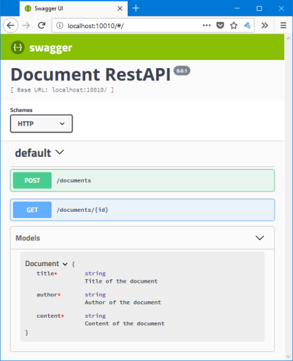

# Beginner's Tutorial - Part 3: Add Swagger UI

The **_Swagger Editor_** is great during development: You can edit your specification YAML file and immediately see the impact on the RestAPI via the integrated graphical user interface on the right half of the window.

During production, you usually do **not** want to provide editing capabilities for the specification of your server. Therefore, you usually do not start _Swagger&nbsp;Editor_. 

## Add Swagger UI to your Project

In order to still have a nice UI which explains your API and allows you to exercise it, we need to add the **_Swagger UI_** to the project (make sure that all servers have been terminated, e.g. with <kbd>ctrl</kbd>+<kbd>c</kbd>):

```
npm install --save swagger-ui-express
npm install --save js-yaml
```

<!-- This increases the footprint of your project on your hard drive from 22.9&nbsp;MByte to 37.5&nbsp;MByte. -->

Open file `app.js`. After 

```js
var config = {
  appRoot: __dirname // required config
};
```

add the following lines:

```js
// For Swagger UI Express
const jsyaml    = require('js-yaml');
const path      = require("path");
const fs        = require('fs');
const swaggerUi = require('swagger-ui-express');
// Read Swagger-API-Spec as YAML and convert it to a JavaScript object:
const swaggerSpec = jsyaml.safeLoad(fs.readFileSync(path.join(__dirname, './api/swagger/swagger.yaml'), 'utf8'));
```

In addition, further down after

```js
  // install middleware
  swaggerExpress.register(app);
```

add the following two lines:

```js
  // For Swagger UI Express
  app.use('/', swaggerUi.serve, swaggerUi.setup(swaggerSpec));
```

The first step loads and initializes the **_Swagger&nbsp;UI_**. With the second step, the _Swagger&nbsp;UI_ is connected to the root path `/` of your server.

## Test Swagger UI

Start the **Express Server** (with `swagger project start`) and navigate your browser to http://localhost:10010/. You should see the **_Swagger&nbsp;Ui_**. It serves as documentation of your API and allows you to use and exercise it similar to the _Swagger&nbsp;Editor_ except that you cannot change the Swagger specification file.



Click on the button <kbd>POST</kbd> and then on <kbd>Try&nbsp;it&nbsp;out</kbd>. Scroll down and click on the blue <kbd>Execute</kbd>-button. Just like with the _Swagger&nbsp;Editor_, you should get a 501 response code with "NOT YET IMPLEMENTED" as message:


&nbsp;

Terminate the _Express Server_ (the one started above with `swagger project start`) with <kbd>ctrl</kbd>+<kbd>c</kbd> in the corresponding terminal.

&nbsp;

## Summary

With **_Swagger&nbsp;UI_**, you get a nice graphical documentation of your RestAPI, dynamically created from the Swagger specification file `api/swagger/swagger.yaml`. It also allows to try out the API methods and see the server response. Opposed to _Swagger&nbsp;Editor_, it has no means to modify the Swagger specification file. Therefore, _Swagger&nbsp;UI_ is better suited for production use than _Swagger&nbsp;Editor_.

During development, you now have the choice:
1. Either use the **_Swagger&nbsp;Editor_** server to edit, inspect and test your RestAPI solely within the browser.
1. Or, edit the `swagger.yaml` file with your favourite text editor and inspect and test it via **_Swagger&nbsp;UI_**. Don't forget to reload your browser after you modified and saved `swagger.yaml`.


## Where to go from here

Please continue with "[Part 4: Add a Database](./tut4-add-database.md)".

Alternatively, you can go back to the previous "[Part 2: Start your own API](./tut2-start-your-own-api.md)" or jump to the "[Beginner's Tutorial Overview Page](./tutorial.md)".
