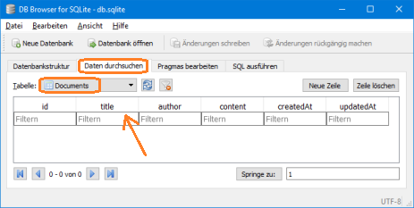
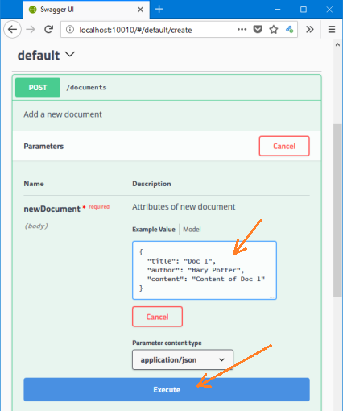
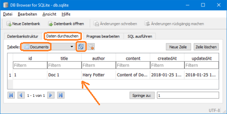
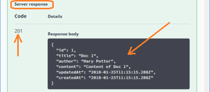
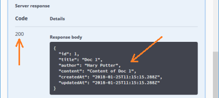
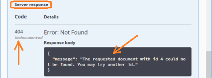

# Beginner's Tutorial - Part 4: Add a Database

For the sake of simplicity, this project uses SQLite3. It comes with a local database file which is used solely by this project. It does not require any database installation like MySQL, MariaDB or PostgreSQL.

When working with a database, you usually have two options:
* Use the database directly via SQL commands.
* Use an Object Relational Management (ORM) library that offers plain JavaScript objects and methods to interact with the database. The SQL stuff is done by the libary behind the scenes.

This project uses the ORM **_Sequelize_**. This library is of great help because you can interact with the database without a need to learn SQL.

But even with an ORM like **_Sequelize_**, you need to define the columns of your tables and map them to the properties of your objects. If we do this, we have two different sources for the data structure:
1. The properties of our document objects in the API is defined by the Swagger specification file `swagger.yaml`.
1. The columns of our documents in the database is defined the ORM configuration.

Such a setup may turn out to be quite dangerous: If you add a property in the API specification, you need to remember to add it to the database as well.

To mitigate such risk, we need to automatically adjust the columns of the document database to the Swagger specification file: If we add or remove properties in the API spec, the corresponding columns should be added or removed automatically in the database, too.

Luckily, there is a node module **_Swagger-Sequelize_** which takes care of this.


## Node Modules for your Database

Execute the following commands in a terminal within your project folder:

```
npm install --save sequelize
npm install --save sqlite3
npm install --save swagger-sequelize
npm install --save js-yaml
```

This adds the following modules to your project:
* sequelize: An ORM that supports MySQL, SQLite, PostgreSQL and MSSQL (details: http://docs.sequelizejs.com)
* sqlite3: Bindings and binaries for SQLite3 for most Node versions and platforms (the details at https://github.com/mapbox/node-sqlite3 are not really relevant for us since SQLite3 is hidden behind Sequelize)
* swagger-sequelize: Automatically adjust the database columns in Sequelize to the data models defined in the Swagger specification file (details: https://github.com/kingsquare/swagger-sequelize)
* js-yaml: Helper library to allow swagger-sequelize to import Swagger specification file in YAML format rather than JSON format (details: https://github.com/nodeca/js-yaml).
  * _Note:_ This module has already been installed in "[Part 3: Add Swagger UI](./tut3-add-swagger-ui.md)". Therefore, you may skip its installation here (on the other side, it does not hurt if you re-install it).

<!--
Your project-folder footprint on your hard drive will grow from 37.6&nbsp;MByte to 58.8&nbsp;MByte. This is only 20&nbsp;MByte for a database with ORM and automated database model creation. Pretty small and pretty cool.
-->

## Setting up Sequelize and Swagger-Sequelize

Create a new folder `api/models` and a new file `api/models/swaggerSequelize.js` with the following content:

```js
'use strict';

const Sequelize = require('sequelize');
const swaggerSequelize = require('swagger-sequelize');
const fs        = require('fs');
const jsyaml    = require('js-yaml');
const path      = require("path");

// For Sequelize with SQLite:
const sequelizeOptions = {
  dialect: 'sqlite', 
  storage: './db.sqlite', 
  operatorsAliases: false
};

const sequelize = new Sequelize(
                       /*database*/ null,
                       /*username*/ null, 
                       /*password*/ null, 
                       /*options */ sequelizeOptions);
swaggerSequelize.setDialect(sequelize.options.dialect);

// Read Swagger-API-Spec as YAML and convert it to an object:
const swaggerSpec = jsyaml.safeLoad(fs.readFileSync(path.join(__dirname, '../swagger/swagger.yaml'), 'utf8'));

module.exports = {
  sequelize,
  swaggerSequelize,
  swaggerSpec
};

```

To use Sequelize and Swagger-Sequelize modify file `app.js` as follows:

Before the line

```js
SwaggerExpress.create(config, function(err, swaggerExpress) {
```

add the following two lines

```js
// Initialize sequelize and swagger-sequelize:
const swaggerSequelize = require("./api/models/swaggerSequelize");
```

## Use the Database in your Controller

Open the file `api/controllers/documents.js` and **replace its entire contents** with the following lines:

```js
'use strict';

// For sequelize and swagger-sequelize:
const swaggerSequelize = require("../models/swaggerSequelize");

// Setup Sequelize-ORM for "Document" based on Swagger API specification:
var DocumentModel =  swaggerSequelize.sequelize.define('Document', swaggerSequelize.swaggerSequelize.generate(swaggerSequelize.swaggerSpec.definitions.Document));

// Setup/sync database table:
// force: false => If table already exists, don't touch or update it.
// force: true  => Delete table if it exists. Then create a new table.
DocumentModel.sync({force: false})
.then(() => { console.log("==>> DocumentModel synched ====================================="); });


// Just for Reference: List of important http status codes:
// 200 OK
// 201 CREATED
// 204 NO CONTENT (Indicates success but nothing is in the response body, 
//                 often used for DELETE and PUT operations.)
// 400 BAD REQUEST (e.g. when data is missing or has wrong data type)
// 401 UNAUTHORIZED (e.g. missing or invalid authentication token)
// 403 FORBIDDEN (unlike a 401 Unauthorized response, 
//                authenticating will make no difference)
// 404 NOT FOUND
// 405 METHOD NOT ALLOWED (e.g. requested URL exists, but the requested 
//                         HTTP method is not applicable. The Allow HTTP 
//                         header must be set when returning a 405 to 
//                         indicate the HTTP methods that are supported.
// 409 CONFLICT (e.g. a resource conflict would be caused by fulfilling the request)
// 500 INTERNAL SERVER ERROR (given when no more specific message is suitable)
// 501 Not Implemented


// The following controller methods are exported to be used by the API:

module.exports.create = (req, res) => {
  console.time("<<<<<< create()"); // Start time measurement
  const reqDocument = req.body;
  console.log("\n>>>>>> create() in controller documents.js");
  console.log("reqDocument:", reqDocument);
  //res.status(501).json({message:"NOT YET IMPLEMENTED"});

  // Create a new document, put it into the database and respond with the newly created document:
  DocumentModel.create(reqDocument).then( (createdDocument) => {
    res.status(201).json(createdDocument);
    console.timeEnd("<<<<<< create()"); // End time measurement
  });
}

module.exports.readById = (req, res) => {
  console.time("<<<<<< readById()"); // Start time measurement
  console.log("\n>>>>>> readById() in controller documents.js");
  const reqId = req.swagger.params.id.value;
  console.log("Requested id:", reqId);
  //res.status(501).json({message:"NOT YET IMPLEMENTED"});

  // Search document with provided reqId:
  DocumentModel
  .findById(reqId) /* Mor generic search .find( { where: { id: reqId } } ) */
  .then( (foundDocument) => {
    if(foundDocument==null) {
      // Document with reqId could not be found
      console.log("Document with requested id "+reqId+" could NOT be found.");
      res.status(404).json({message:"The requested document with id "+reqId+" could not be found. You may try another id."});
      console.timeEnd("<<<<<< readById()"); // End time measurement
    } else {
      console.log("Document with requested id "+reqId+" is found. Responding with object");
      console.log(foundDocument.dataValues);
      res.json(foundDocument);
      console.timeEnd("<<<<<< readById()"); // End time measurement
    }
  });
}

```

Todo: Add some explanation ...

## Test your RestAPI with Database

Start the **Express Server** (with `swagger project start`). The first thing you should note is some additional output in the terminal:

```
Executing (default): CREATE TABLE IF NOT EXISTS `Documents`
 (`id` INTEGER PRIMARY KEY AUTOINCREMENT, `title` VARCHAR(255),
  `author` VARCHAR(255), `content` VARCHAR(255),
  `createdAt` DATETIME NOT NULL, `updatedAt` DATETIME NOT NULL);
Executing (default): PRAGMA INDEX_LIST(`Documents`)
==>> DocumentModel synched =====================================
```

This means that a new table _Documents_ has been created in the database. 

You should also find an additional file in your project folder: `db.sqlite`. This is the storage location of the SQLite3 database. You can use open source and freeware tools to inspect the database file. For example, you may try ["DB Browser for SQLite"](http://sqlitebrowser.org/) which is available for free and for various operating systems. If you open `db.sqlite` with it and browse the data, you should see the new table _Documents_:



As you can see, there are columns for the properties `title`, `author` and `content`. They are defined in the Swagger specification file `swagger.yaml`. In addition, there are columns `id`, `createdAt` and `updatedAt`: They are added as default columns by Sequelize. Their content is taken care of by Sequelize, too.

Navigate your browser to the **_Swagger&nbsp;UI_** at http://localhost:10010/#/default/create, click on the <kbd>Try it out</kbd>-button and and fill in the text field for "newDocument" as follows:

| title | author      | contents         |
|-------|-------------|------------------|
| Doc 1 | Hary Potter | Content of Doc 1 |



Click on the button <kbd>Execute</kbd> and watch the output in the terminal:

```
>>>>>> create() in controller documents.js
reqDocument: { title: 'Doc 1',
  author: 'Hary Potter',
  content: 'Content of Doc 1' }
Executing (default): INSERT INTO `Documents` (`id`,`title`,`author`,`content`,
 `createdAt`,`updatedAt`) VALUES (NULL,'Doc 1','Hary Potter', 'Content of Doc 1',
 '2018-01-25 11:15:15.288 +00:00','2018-01-25 11:15:15.288 +00:00');
<<<<<< create(): 131.424ms
```

Congratulations, you have successfully executed your first HTTP-POST into the SQLite3-Database. When you refresh the view in "DB Browser for SQLite", you should see the first row in the _Documents_ table:



You should also see a corresponding server response with status code 201 in the _Swagger&nbsp;UI_:



As you can see from the above, the new document got the **id** 1. Therefore, we should be able to retive it with a GET-request:

Navigate your browser to http://localhost:10010/#/default/readById, click on the <kbd>Try it out</kbd>-button, enter a "1" into the "Document id" text field and click on the <kbd>Execute</kbd>-button.

You should now get a server response with status code 200 and a response body with your first document:



In addition, you should see the following debug-output in the terminal window:

```
>>>>>> readById() in controller documents.js
Requested id: 1
Executing (default): SELECT `id`, `title`, `author`, `content`, `createdAt`, `updatedAt` FROM `Documents` AS `Document` WHERE `Document`.`id` =
 1;
Document with requested id 1 is found. Responding with object
{ id: 1,
  title: 'Doc 1',
  author: 'Hary Potter',
  content: 'Content of Doc 1',
  createdAt: 2018-01-25T11:15:15.288Z,
  updatedAt: 2018-01-25T11:15:15.288Z }
<<<<<< readById(): 19.450ms
```

If you request a non existing document, e.g. with an id of 4, you should get a 404 response:



```
>>>>>> readById() in controller documents.js
Requested id: 4
Executing (default): SELECT `id`, `title`, `author`, `content`, `createdAt`, `updatedAt` FROM `Documents` AS `Document` WHERE `Document`.`id` =
 4;
Document with requested id 4 could NOT be found.
<<<<<< readById(): 15.341ms
```


## Summary

In this part, we added a SQLite3 database with **Sequelize** as our ORM and **Swagger-Sequelize** for automated database configuration based on our Swagger specification file. 

We tested our implementation by adding a first document via HTTP-POST and retrieving it via HTTP-GET.

We are able to inspect the SQLite3 database file `db.sqlite` with the help of ["DB Browser for SQLite"](http://sqlitebrowser.org/).

## Where to go from here

Please continue with "[Part 5: Remaining Endpoints and Request-Handler](./tut5-remaining.md)".

Alternatively, you can go back to the previous "[Part 3: Add Swagger UI](./tut3-add-swagger-ui.md)" or jump to the "[Beginner's Tutorial Overview Page](./tutorial.md)".
