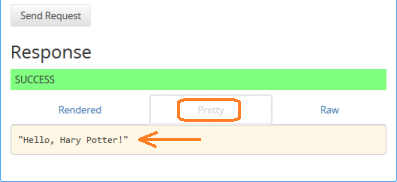
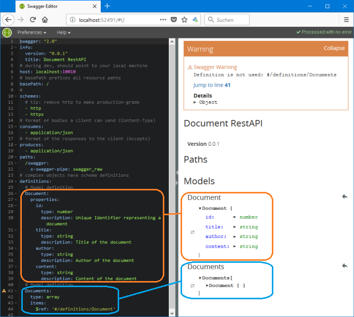

# Tutorial: RestAPI with Swagger, Express, Sequelize and SQLite

This page provides a step-by-step tutorial to develop the document server on your own.

## Prerequisites

* If not done already: Install [NodeJS](https://nodejs.org) **v6** or higher.
* If not done already: Install Swagger-Node by `npm install -g swagger`

## Getting started

* Fire up a terminal, change to the folder of your desited working location, run `swagger project create swagger2-express-sequelize` and select "Express" as Framework.
* Wait until the project folder `swagger2-express-sequelize` is created and "npm&nbsp;install" is completed (needs internet connection)
* Change directory into the new project folder `swagger2-express-sequelize` and open your favourite texteditor (e.g. [VSCode](https://code.visualstudio.com/)) from there.
* To start the **Express server** of our new RestAPI, run `swagger project start` from within the project folder.
  * This fires up the express server on port 10010.
  * Navigate your web browser to http://localhost:10010/hello.<br>
    As response, you should get the JSON-String `"Hello, stranger!"`.
  * Navigate our web browser to <a href="http://localhost:10010/hello?name=Hary Potter">http://localhost:10010/hello?name=Hary Potter</a>.<br>
    As response, you should get the JSON-String `"Hello, Hary Potter!"`.
  * The server automatically detects file changes and restarts itself. If this creates too heavy CPU load, terminate it while editing and restart it for testing.
* To start the **Swagger editor**, open an additional terminal (or dos-prompt) and run `swagger project edit` from within the project folder.
  * This fires up an additional server, the swagger editor server with a port number usually above 50000.
  * Navigate your web browser to the URL which is shown in the terminal.
  * You should see the YAML-Editor on the left and the UI-representation on the right:<br>
    <br>
    Most likely, you will have a different port number than the one shonw in the above screen shot.
  * You can test the express server from the UI-representation of the editor. In the right half, click on the button "Try&nbsp;this&nbsp;operation" and enter "Hary Potter" (without quotations) in the "name" field. Then, click on the button "send&nbsp;request" at the bottom:<br>
  
  * In the "Response" area, select the "Pretty" tab. You should see `"Hello, Hary Potter!"`.<br>
    
* Start to understand the project file structure:
  * Open the file `api/swagger/swagger.yaml` in your text editor. This is the file which is shown in the Swagger Editor in your browser. 
    * In the Swagger Editor in the browser, change line&nbsp;4 from `title: Hello World App` to `title: Hello Swagger World`.
    * You should see that the content of file `api/swagger/swagger.yaml` has been changed accordingly.
  * Open the file `api/controllers/hello_world.js` in your text editor. 
    * At the bottom of the file, change line<br>
      `var name = req.swagger.params.name.value || 'stranger';`<br>
      to<br>
      `var name = req.swagger.params.name.value || 'cool stranger';`
    * Save the file.
    * In the UI part of the Swagger Editor, make sure that the field "name" is empty. Then, click on the button "send&nbsp;request". You should see `"Hello, cool stranger!"` as the response.<br>
    
* Terminate both, the Express Server and the Swagger Editor server with <kbd>ctrl</kbd>+<kbd>c</kbd> in each terminal.


**Summary**

In this section, we created a new swagger project for the express framework. We fired up two servers:
* the express server for our "real" API.
* the swagger editor server for modifying the swagger spec file and for running http requests against the exress server.

We learned that the Swagger spec file is served from `api/swagger/swagger.yaml` and that the response behaviour of the server is defined in the controller file `api/controllers/hello_world.js`.


## Spec sceleton and Model definition

Open the file `api/swagger/swagger.yaml` in your text editor and replace its entire contents with the following code:

```yaml
swagger: "2.0"
info:
  version: "0.0.1"
  title: Document RestAPI
# during dev, should point to your local machine
host: localhost:10010
# basePath prefixes all resource paths 
basePath: /
# 
schemes:
  # tip: remove http to make production-grade
  - http
  - https
# format of bodies a client can send (Content-Type)
consumes:
  - application/json
# format of the responses to the client (Accepts)
produces:
  - application/json
paths:
  /swagger:
    x-swagger-pipe: swagger_raw
# complex objects have schema definitions
definitions:
  # Model definition
  Document:
    properties:
      id:
        type: number
        description: Unique Identifier representing a document
      title:
        type: string
        description: Title of the document
      author:
        type: string
        description: Author of the document
      content:
        type: string
        description: Content of the document
```

<!-- 
  # Model definition
  Documents:
    type: array
    items:
      $ref: '#/definitions/Document'
-->

Start the Swagger Editor Server with `swagger project edit` and navigate your web browser to http://localhost:52491/#!/ (the Express server is not needed, yet):<br>

<!--  -->


Swagger Spec-File erweitern

```yaml
swagger: "2.0"
info:
  version: "0.0.1"
  title: Document RestAPI
# during dev, should point to your local machine
host: localhost:10010
# basePath prefixes all resource paths 
basePath: /
# 
schemes:
  # tip: remove http to make production-grade
  - http
  - https
# format of bodies a client can send (Content-Type)
consumes:
  - application/json
# format of the responses to the client (Accepts)
produces:
  - application/json
paths:
  /documents:
    x-swagger-router-controller: documents
    post:
      description: Add a new document
      operationId: create
      parameters:
        - name: document
          description: Document properties
          in: body
          required: true
          schema:
            $ref: "#/definitions/Document"
      responses:
        "201":
          $ref: "#/responses/Response"
        default:
          $ref: "#/responses/ErrorResponse"
  /documents/{id}:
    x-swagger-router-controller: documents
    get:
      description: Get a document by its ID
      operationId: readById
      parameters:
        - name: id
          description: Document id
          type: number
          in: path
          required: true
      responses:
        "200":
          description: Success
          schema:
            $ref: "#/definitions/Document"
        default:
          $ref: "#/responses/ErrorResponse"
  /swagger:
    x-swagger-pipe: swagger_raw
# complex objects have schema definitions
definitions:
  # Model definition
  Document:
    properties:
      id:
        type: number
        description: Unique Identifier representing a document
      title:
        type: string
        description: Title of the document
      author:
        type: string
        description: Author of the document
      content:
        type: string
        description: Content of the document
    required:
      - id
      - title
      - author
      - content
# response definitions:
responses:
  Response:
    description: Success
    schema:
      type: object
      properties:
        success:
          type: number
        description:
          type: string
      required:
        - success
        - description
  ErrorResponse:
    description: Error
    schema:
      required:
        - message
      properties:
        message:
          type: string
```

Neue Controller-Datei `api/controllers/documents.js`:

```js
'use strict';

module.exports = {
  create,
  readById
};
  
function create(req, res) {
  const document = req.body;
  console.log("Controller: documents.js; Function: create() mit document:");
  console.log(document);
  // HIER: Datenbank-aufruf
  res.status(201).json(
    {
      success: 1,
      description: 'Document created and saved',
    }
  );
}

function readById(req, res) {
  const id = req.swagger.params.id.value;
  console.log("Controller: documents.js; Function: readById() mit id:", id);
  // Document mit id suchen.
  // Falls gefunden: res.json(document);
  // Falls nicht:    res.status(404).send();

  // Dummy-Wert:
  const resultObject = {
    id: id,
    title: "Titel des Dokuments",
    author: "Meiner einer",
    content: "Inhalt des Dokuments"
  }
  console.log("Controller: documents.js; Function: readById(): Liefere Objekt");
  console.log(resultObject);
  res.json(resultObject);
}
```

## Add additional Modules

Add Sequelize and SQLite3:

```
npm install --save sequelize
npm install --save sqlite3
```

Add Swagger-Sequelize and js-yaml

```
npm install --save swagger-sequelize
npm install --save js-yaml
```

Swagger-Sequelize is needed to auto-generate the Sequelize-Definitions from the Swagger file.

js-yaml is needed to read the Swagger YAML file and parse it into a JavaScript Object.


Add Swagger UI Express: This allows you to exercise the API without running the Swagger Editor Server

```
npm install --save swagger-ui-express
```


Patch von **swagger-sequelize**:

In Datei `node_modules/swagger-sequelize/index.js` die Funktion `generate()` erweitern von:

```JavaScript
function generate (schema) {
	//poor mans deep-clone
	var result = JSON.parse(JSON.stringify(schema.properties));

	Object.keys(result).forEach((propertyName) => {
		var propertySchema = result[propertyName];
		propertySchema.type = getSequalizeType(propertySchema);
		if (propertySchema.default) {
			propertySchema.defaultValue = propertySchema.default;
		}
	});

	return result;
}
```

nach

```JavaScript
function generate (schema) {
	//poor mans deep-clone
	var result = JSON.parse(JSON.stringify(schema.properties));

	Object.keys(result).forEach((propertyName) => {
		var propertySchema = result[propertyName];
		// BEGIN: Promote Attribute to primaryKey with autoIncrement
		if(propertySchema["x-primary-key"]==true) {
			propertySchema.primaryKey = true;
			propertySchema.autoIncrement = true;
		}
		// END: Promote Attribute to primaryKey with autoIncrement

		propertySchema.type = getSequalizeType(propertySchema);
		if (propertySchema.default) {
			propertySchema.defaultValue = propertySchema.default;
		}
	});

	return result;
}
```


## Documentation Ressources

* HTTP and RestAPIs:
  * REST API Quick Tips: http://www.restapitutorial.com/lessons/restquicktips.html
  * Using HTTP Methods for RESTful Services: http://www.restapitutorial.com/lessons/httpmethods.html
  * Resource Naming: http://www.restapitutorial.com/lessons/restfulresourcenaming.html
* Swagger
  * HomePage: https://swagger.io/
  * Swagger 2.0 documentation: https://swagger.io/docs/specification/2-0/basic-structure/
* Sequelize
  * Documenation: http://docs.sequelizejs.com/
  * GitHub: https://github.com/sequelize/sequelize.git
